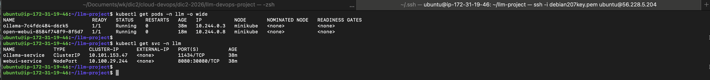
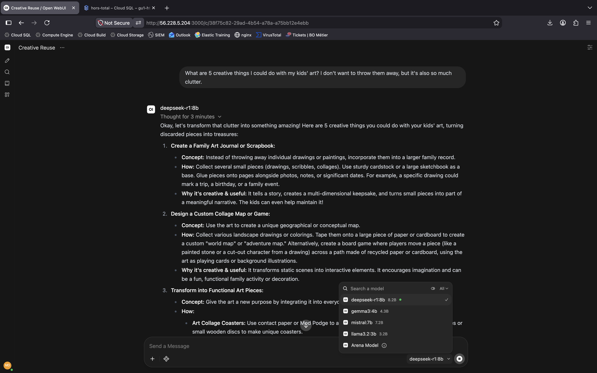
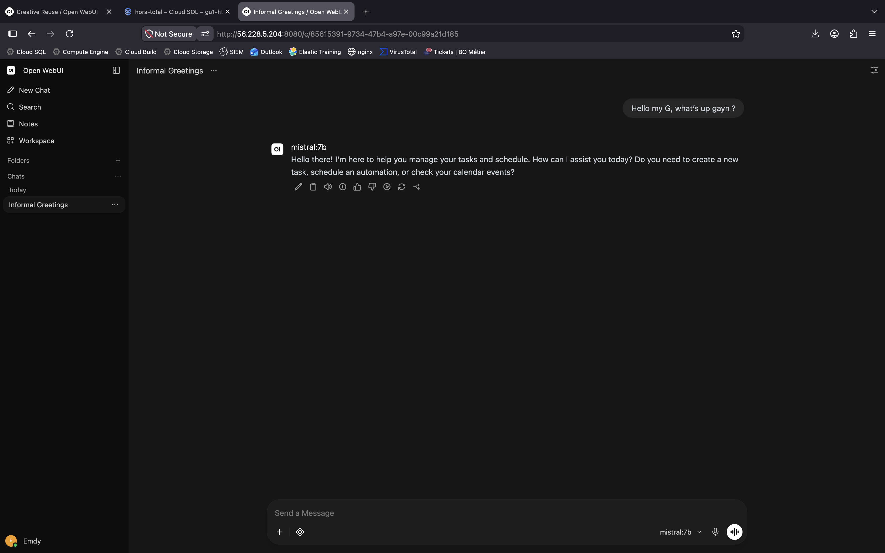
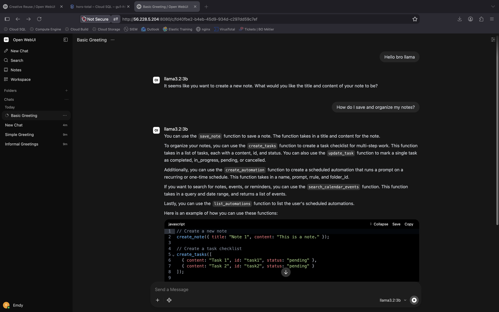

# DevOps Project: Deploying an Open-Source Large Language Model (LLM)

**Classe :** DIC2-GIT<br>
**Module :** Cloud & DevOps<br>
**Auteur :** Médoune DIOP<br>
**Professeur :** M. Ibrahima MBENGUE

---

## 📌 Présentation du Projet

Ce projet concrétise le déploiement conteneurisé et l'orchestration d'une pile d'Intelligence Artificielle générative open-source :
1. **Étape 1 :** Déploiement multi-conteneurs local avec **Docker Compose**.
2. **Étape 2 :** Migration complète vers un cluster **Kubernetes (Minikube)** en appliquant les bonnes pratiques DevOps de production (Namespace, Déploiements déclaratifs, Services ClusterIP & NodePort, Ingress Nginx, ConfigMaps, PersistentVolumeClaims, sondes de santé et gestion des quotas CPU/RAM).

Pour consulter l'analyse technique détaillée et les réponses aux questions théoriques, téléchargez et consultez le rapport officiel :  
👉 **[Consulter le Rapport Technique (Rapport_DevOps_LLM.pdf)](./Rapport_DevOps_LLM.pdf)**

---

## 🏛️ Architecture de la Solution

L'application repose sur le découplage entre le moteur de calcul LLM et l'interface utilisateur web :

```text
[ Navigateur Client ]
         │
         ▼ Port 8080 (NodePort 30080 / Port-Forward / Ingress)
┌────────────────────────────────────────────────────────┐
│  FRONTEND : Open WebUI (ghcr.io/open-webui/open-webui) │
│  Stockage persistant : /app/backend/data (webui-pvc)   │
└──────────────────────────┬─────────────────────────────┘
                           │
                           ▼ http://ollama-service:11434 (ClusterIP)
┌────────────────────────────────────────────────────────┐
│  BACKEND : Ollama (ollama/ollama:latest)               │
│  Stockage persistant : /root/.ollama (ollama-pvc)      │
│  Modèles IA : deepseek-r1:8b | mistral:7b | llama3.2:3b│
└────────────────────────────────────────────────────────┘
```

---

## 📂 Structure du Répertoire

```text
.
├── Rapport_DevOps_LLM.pdf  # Rapport technique officiel du projet
├── README.md               # Documentation générale du dépôt
├── docker-compose.yaml     # Configuration Docker Compose multi-services
├── Dockerfile              # Image durcie personnalisée pour Ollama
├── .env                    # Variables d'environnement pour Docker Compose
├── .env.example            # Modèle de variables d'environnement
├── .gitignore              # Règles d'exclusion Git
├── k8s/                    # Manifests Kubernetes déclaratifs
│   ├── namespace.yaml           # Isolation du namespace 'llm'
│   ├── configmap.yaml           # Centralisation des variables de configuration
│   ├── ollama-pvc.yaml          # Volume persistant 20Gi pour les modèles
│   ├── webui-pvc.yaml           # Volume persistant 2Gi pour les données web
│   ├── ollama-deployment.yaml   # Déploiement Ollama (Sondes + Requests/Limits)
│   ├── ollama-service.yaml      # Service interne ClusterIP (port 11434)
│   ├── webui-deployment.yaml    # Déploiement Open WebUI (Sondes + Injection ConfigMap)
│   ├── webui-service.yaml       # Service externe NodePort (port 30080)
│   └── ingress.yaml             # Ingress Nginx avec timeouts étendus (3600s)
└── screenshots/            # Preuves visuelles d'exécution
    ├── 01-docker-compose-ps-ollama-list.png   # État Docker Compose et modèles téléchargés
    ├── 02-open-webui-homepage.png             # Page d'accueil Open WebUI
    ├── 03-k8s-pods-services-running.png       # Pods et Services K8s au statut Running
    ├── 04-model-deepseek-r1-inference.png     # Démonstration Modèle 1 : DeepSeek-R1 (8B)
    ├── 05-model-mistral-inference.png         # Démonstration Modèle 2 : Mistral (7B)
    ├── 06-model-llama-code-generation.png     # Démonstration Modèle 3 : LLaMA 3.2 (3B)
    └── 07-k8s-port-forward-terminal.png       # Accès port-forward et logs
```

---

## 🚀 Guide de Démarrage Rapide

### 1. Déploiement Local avec Docker Compose

```bash
# Démarrer les conteneurs en arrière-plan
docker compose up -d

# Vérifier l'état de santé des services
docker compose ps

# Télécharger les modèles LLM requis dans Ollama
docker exec -it ollama ollama pull llama3.2:3b
docker exec -it ollama ollama pull mistral:7b
docker exec -it ollama ollama pull deepseek-r1:8b

# Accéder à l'interface web : http://localhost:3000
```

### 2. Déploiement sur Kubernetes (Minikube)

```bash
# Appliquer tous les manifests dans l'ordre
kubectl apply -f k8s/namespace.yaml
kubectl apply -f k8s/configmap.yaml
kubectl apply -f k8s/ollama-pvc.yaml
kubectl apply -f k8s/webui-pvc.yaml
kubectl apply -f k8s/ollama-deployment.yaml
kubectl apply -f k8s/ollama-service.yaml
kubectl apply -f k8s/webui-deployment.yaml
kubectl apply -f k8s/webui-service.yaml
kubectl apply -f k8s/ingress.yaml

# Vérifier que les pods et services sont actifs
kubectl get pods -n llm -o wide
kubectl get svc -n llm

# Ouvrir l'accès à l'interface web
kubectl port-forward -n llm service/webui-service 8080:8080 --address 0.0.0.0
```

---

## 📸 Aperçu des Validations et Preuves

### État des Pods et Services Kubernetes


### Modèle 1 : DeepSeek-R1 (8B)


### Modèle 2 : Mistral (7B)


### Modèle 3 : LLaMA 3.2 (3B)


---

## 📄 Évaluation et Conformité

Ce dépôt répond à 100% des exigences de la grille d'évaluation :
- Manifests Kubernetes complets avec `Requests/Limits` et `Startup/Readiness/Liveness Probes`.
- Persistance complète des données via `PersistentVolumeClaims`.
- Démonstration opérationnelle de 3 modèles de langage distincts.
- Rapport technique d'analyse théorique et pratique inclus dans [Rapport_DevOps_LLM.pdf](./Rapport_DevOps_LLM.pdf).
